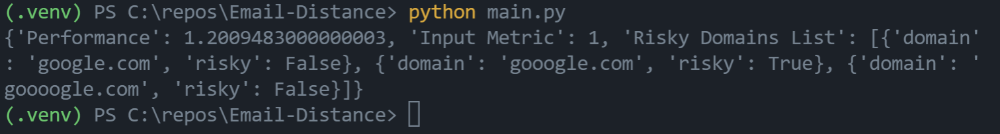

# Email-Distance

List of 1000 most popular domains worldwide obtained from 'https://www.htmlstrip.com/alexa-top-1000-most-visited-websites'  

## Execution

* * *  

To run this application, clone this repository and run the following commands:  
`python3 -m pip install -r requirements.txt`  
`python3 main.py`  
Output:  

## Variables

* * *  

input variables are placed in `config.py`  

- trusted_domains_file = path of trusted domains csv
- distance = input metric used as cutoff for distance calculation
- in_list = list containing domains to be checked

## Note

* * *  

This application is optimized for speed. Each site's risk is calculated in parallel. Levenshtein distance is also calculated in parallel.  

- The Levenshtein module in use requires C++ packages to install on windows
